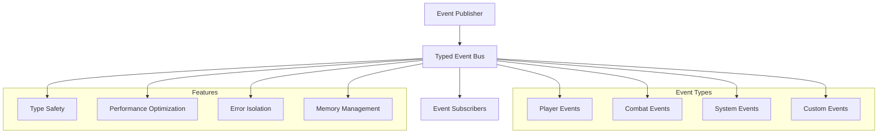

# Typed Event Bus

The Typed Event Bus provides a type-safe, high-performance event system for mod-to-mod and internal communication. It enables decoupled architectures where components can react to events without direct dependencies.

---

## 📡 What is the Typed Event Bus?

The Typed Event Bus is a publish-subscribe system that allows:

* **Type-safe event handling** - Compile-time event type checking
* **Decoupled communication** - Components communicate without direct references
* **High performance** - Optimized for frequent event processing
* **Memory efficient** - Minimal allocations and garbage collection pressure

---

## 🎯 Why Use an Event Bus?

### **Traditional Coupled Architecture**
```csharp
// Tightly coupled - bad practice
public class ArenaSystem
{
    private readonly BossSystem _bossSystem;
    private readonly PlayerSystem _playerSystem;
    
    public void StartArena()
    {
        _bossSystem.SpawnBoss(); // Direct dependency
        _playerSystem.NotifyPlayers(); // Direct dependency
    }
}
```

### **Event-Driven Architecture**
```csharp
// Loosely coupled - good practice
public class ArenaSystem
{
    public void StartArena()
    {
        TypedEventBus.Publish(new ArenaStartedEvent());
    }
}

public class BossSystem
{
    public BossSystem()
    {
        TypedEventBus.Subscribe<ArenaStartedEvent>(OnArenaStarted);
    }
    
    private void OnArenaStarted(ArenaStartedEvent evt)
    {
        SpawnBoss();
    }
}
```

---

## 🏗️ Architecture Overview



---

## 📝 Event Types

### **Built-in Player Events**

```csharp
// Player lifecycle events
public record PlayerEnteredZoneEvent(Entity Player, string ZoneName, DateTime Timestamp);
public record PlayerLeftZoneEvent(Entity Player, string ZoneName, DateTime Timestamp);
public record PlayerDeathEvent(Entity Player, Entity Killer, Vector3 Position, DateTime Timestamp);
public record PlayerRespawnEvent(Entity Player, Vector3 Position, DateTime Timestamp);

// Player state events
public record PlayerLevelUpEvent(Entity Player, int OldLevel, int NewLevel, DateTime Timestamp);
public record PlayerHealthChangedEvent(Entity Player, float OldHealth, float NewHealth, DateTime Timestamp);
public record PlayerBuffAppliedEvent(Entity Player, PrefabGUID Buff, float Duration, DateTime Timestamp);
```

### **Built-in Combat Events**

```csharp
// Combat lifecycle
public record CombatStartedEvent(Entity Attacker, Entity Defender, DateTime Timestamp);
public record CombatEndedEvent(Entity Attacker, Entity Defender, CombatResult Result, DateTime Timestamp);
public record DamageDealtEvent(Entity Attacker, Entity Defender, float Damage, DamageType Type, DateTime Timestamp);

// Boss events
public record BossDefeatedEvent(Entity Boss, Entity Killer, string ZoneName, TimeSpan CombatDuration, DateTime Timestamp);
public record BossPhaseChangedEvent(Entity Boss, int OldPhase, int NewPhase, DateTime Timestamp);
```

### **Built-in System Events**

```csharp
// Server lifecycle
public record ServerStartupEvent(DateTime StartTime, string Version);
public record ServerShutdownEvent(DateTime ShutdownTime, ShutdownReason Reason);
public record ServerSaveEvent(DateTime SaveTime, string SavePath);

// Zone events
public record ZoneStateChangedEvent(string ZoneName, ZoneState OldState, ZoneState NewState, DateTime Timestamp);
public record ZonePopulationChangedEvent(string ZoneName, int OldCount, int NewCount, DateTime Timestamp);
```

---

## 📮 Publishing Events

### **Basic Event Publishing**

```csharp
// Publish a simple event
TypedEventBus.Publish(new PlayerEnteredZoneEvent(playerEntity, "arena", DateTime.UtcNow));

// Publish with result tracking
var handlerCount = TypedEventBus.PublishAndCount(new BossDefeatedEvent(bossEntity, killer, "arena", combatDuration, DateTime.UtcNow));
Logger.Info($"Boss defeated event handled by {handlerCount} subscribers");
```

### **Batch Event Publishing**

```csharp
// Publish multiple events efficiently
var events = new List<IEvent>
{
    new ZoneStateChangedEvent("arena", ZoneState.Inactive, ZoneState.Active, DateTime.UtcNow),
    new PlayerEnteredZoneEvent(player1, "arena", DateTime.UtcNow),
    new PlayerEnteredZoneEvent(player2, "arena", DateTime.UtcNow),
    new CombatStartedEvent(player1, bossEntity, DateTime.UtcNow)
};

TypedEventBus.PublishBatch(events);
```

### **Async Event Publishing**

```csharp
// Publish events asynchronously
await TypedEventBus.PublishAsync(new PlayerDeathEvent(player, killer, position, DateTime.UtcNow));

// Async batch publishing
await TypedEventBus.PublishBatchAsync(events);
```

---

## 🔗 Subscribing to Events

### **Basic Subscription**

```csharp
public class ArenaSystem
{
    public ArenaSystem()
    {
        // Subscribe to player events
        TypedEventBus.Subscribe<PlayerEnteredZoneEvent>(OnPlayerEnteredZone);
        TypedEventBus.Subscribe<PlayerLeftZoneEvent>(OnPlayerLeftZone);
        
        // Subscribe to combat events
        TypedEventBus.Subscribe<BossDefeatedEvent>(OnBossDefeated);
    }
    
    private void OnPlayerEnteredZone(PlayerEnteredZoneEvent evt)
    {
        if (evt.ZoneName == "arena")
        {
            Logger.Info($"Player entered arena: {evt.Player}");
            // Handle arena entry logic
        }
    }
    
    private void OnBossDefeated(BossDefeatedEvent evt)
    {
        Logger.Info($"Boss defeated in {evt.ZoneName} by {evt.Killer}");
        // Handle boss defeat logic
        StartArenaCleanup();
    }
}
```

### **Filtered Subscription**

```csharp
public class ZoneManager
{
    public ZoneManager()
    {
        // Subscribe with filter for arena events only
        TypedEventBus.Subscribe<PlayerEnteredZoneEvent>(
            OnArenaPlayerEntered,
            evt => evt.ZoneName == "arena"
        );
    }
    
    private void OnArenaPlayerEntered(PlayerEnteredZoneEvent evt)
    {
        // This only fires for arena entries
        UpdateArenaPopulation(1);
    }
}
```

### **Scoped Subscription**

```csharp
public class TemporarySystem : IDisposable
{
    private readonly IDisposable _subscription;
    
    public TemporarySystem()
    {
        // Auto-unsubscribe when disposed
        _subscription = TypedEventBus.SubscribeScoped<PlayerDeathEvent>(OnPlayerDeath);
    }
    
    private void OnPlayerDeath(PlayerDeathEvent evt)
    {
        Logger.Info($"Player death handled by temporary system");
    }
    
    public void Dispose()
    {
        _subscription?.Dispose(); // Automatically unsubscribes
    }
}
```

---

## 🎮 Integration with Other Systems

### **Flow Integration**

```json
{
  "flows": {
    "boss_defeated_celebration": {
      "triggers": [
        { "type": "event", "event": "BossDefeatedEvent" }
      ],
      "actions": [
        { "action": "zone.message", "message": "🎉 Boss defeated! Great job!" },
        { "action": "zone.setpvp", "value": false },
        { "action": "spawn.rewards", "prefab": "chest_epic", "count": 3 }
      ]
    }
  }
}
```

### **Cross-Mod Communication**

```csharp
// Publish events that other mods can consume
public class BossMod
{
    public void OnBossDefeated(Entity boss, Entity killer)
    {
        var evt = new BossDefeatedEvent(boss, killer, GetCurrentZone(), GetCombatDuration(), DateTime.UtcNow);
        
        // Publish locally
        TypedEventBus.Publish(evt);
        
        // Broadcast to other mods
        ModCommunication.BroadcastEvent(evt);
    }
}

// Consume events from other mods
public class LootMod
{
    public LootMod()
    {
        ModCommunication.RegisterEventHandler<BossDefeatedEvent>(OnExternalBossDefeated);
    }
    
    private void OnExternalBossDefeated(BossDefeatedEvent evt)
    {
        // Handle boss defeats from other mods
        SpawnSpecialLoot(evt.Killer, evt.ZoneName);
    }
}
```

---

## ⚡ Performance Characteristics

| Operation | Performance | Notes |
|-----------|-------------|-------|
| **Event Publish** | < 0.1ms | Direct dispatch to subscribers |
| **Event Subscribe** | < 0.01ms | Hash table insertion |
| **Batch Publish** | 0.1-1ms | Depends on event count |
| **Filtered Publish** | 0.1-0.5ms | Filter evaluation overhead |
| **Memory Allocation** | Minimal | Uses object pooling |

---

## 🛡️ Safety Features

### **Error Isolation**

```csharp
// Event handlers are isolated - one failure won't crash others
TypedEventBus.Subscribe<PlayerDeathEvent>(OnPlayerDeath);

private void OnPlayerDeath(PlayerDeathEvent evt)
{
    try
    {
        // Complex logic that might fail
        ProcessPlayerDeath(evt);
    }
    catch (Exception ex)
    {
        Logger.Error($"Error handling player death: {ex.Message}");
        // Other subscribers still receive the event
    }
}
```

### **Memory Management**

```csharp
// Events are automatically cleaned up
public class PlayerSystem
{
    public void OnPlayerDisconnect(Entity player)
    {
        // Unsubscribe all handlers for this player
        TypedEventBus.UnsubscribeAllForContext(player);
        
        // Or unsubscribe specific handlers
        TypedEventBus.Unsubscribe<PlayerDeathEvent>(OnPlayerDeath);
    }
}
```

### **Thread Safety**

```csharp
// Event bus is thread-safe
Task.Run(() => {
    // Can publish from any thread
    TypedEventBus.Publish(new PlayerEnteredZoneEvent(player, "arena", DateTime.UtcNow));
});

// Subscriptions are also thread-safe
TypedEventBus.Subscribe<PlayerEnteredZoneEvent>(OnPlayerEnteredZone);
```

---

## 🔧 Configuration

Event bus behavior can be configured:

```json
{
  "events": {
    "enable_performance_monitoring": false,
    "max_subscribers_per_event": 100,
    "enable_event_history": false,
    "event_history_size": 1000,
    "enable_detailed_logging": false
  }
}
```

### **Configuration Options**

| Setting | Default | Description |
|---------|---------|-------------|
| `enable_performance_monitoring` | false | Track event processing times |
| `max_subscribers_per_event` | 100 | Maximum subscribers per event type |
| `enable_event_history` | false | Keep history of published events |
| `event_history_size` | 1000 | Number of events to keep in history |
| `enable_detailed_logging` | false | Detailed event logging |

---

## 🚀 Advanced Features

### **Custom Event Types**

```csharp
// Define custom events for your mod
public record CustomModEvent(
    string ModName,
    string EventType,
    Dictionary<string, object> Data,
    DateTime Timestamp
) : IEvent;

// Publish custom events
TypedEventBus.Publish(new CustomModEvent(
    "MyMod",
    "SpecialAction",
    new Dictionary<string, object> { { "player", playerEntity }, { "action", "dance" } },
    DateTime.UtcNow
));
```

### **Event Composition**

```csharp
// Create composite events
public record ComplexGameEvent(
    PlayerDeathEvent PlayerDeath,
    BossDefeatedEvent BossDefeat,
    ZoneStateChangedEvent ZoneChange
) : IEvent;

// Publish complex events
TypedEventBus.Publish(new ComplexGameEvent(playerDeath, bossDefeat, zoneChange));
```

### **Event Middleware**

```csharp
// Add event processing middleware
TypedEventBus.AddMiddleware(async (evt, next) => {
    // Pre-processing
    Logger.Debug($"Processing event: {evt.GetType().Name}");
    
    // Continue processing
    await next();
    
    // Post-processing
    Logger.Debug($"Event processed: {evt.GetType().Name}");
});
```

---

## 🔍 Debugging and Monitoring

### **Event Monitoring**

```csharp
// Get event bus statistics
var stats = TypedEventBus.GetStatistics();
Logger.Info($"Total event types: {stats.TotalEventTypes}");
Logger.Info($"Total subscribers: {stats.TotalSubscribers}");
Logger.Info($"Events published today: {stats.EventsPublishedToday}");

// Get specific event statistics
var playerEventStats = TypedEventBus.GetEventStatistics<PlayerDeathEvent>();
Logger.Info($"Player death subscribers: {playerEventStats.SubscriberCount}");
Logger.Info($"Player deaths today: {playerEventStats.PublishCount}");
```

### **Event History**

```csharp
// Enable event history for debugging
TypedEventBus.EnableEventHistory(1000);

// Query recent events
var recentDeaths = TypedEventBus.GetRecentEvents<PlayerDeathEvent>(TimeSpan.FromHours(1));
foreach (var death in recentDeaths)
{
    Logger.Info($"Recent death: {death.Player} at {death.Timestamp}");
}
```

### **Performance Profiling**

```csharp
// Enable performance monitoring
TypedEventBus.EnablePerformanceMonitoring();

// Get slow events
var slowEvents = TypedEventBus.GetSlowEvents(TimeSpan.FromMilliseconds(10));
foreach (var (eventType, avgTime, maxTime) in slowEvents)
{
    Logger.Warning($"Slow event detected: {eventType.Name} - Avg: {avgTime}ms, Max: {maxTime}ms");
}
```

---

## 📚 Best Practices

### **Event Design**
1. **Use immutable records** - Events should be immutable
2. **Include timestamps** - Always include when the event occurred
3. **Be specific** - Create specific event types for different scenarios
4. **Avoid circular dependencies** - Events shouldn't reference each other

### **Subscription Management**
1. **Unsubscribe when done** - Prevent memory leaks
2. **Use scoped subscriptions** - Auto-cleanup with IDisposable
3. **Handle errors gracefully** - Don't let one subscriber break others
4. **Filter appropriately** - Use filters to reduce unnecessary processing

### **Performance Optimization**
1. **Batch events** - Group related events together
2. **Use async for heavy processing** - Don't block the event thread
3. **Monitor performance** - Watch for slow event handlers
4. **Limit subscriber count** - Too many subscribers can impact performance

---

## 🎯 Use Cases

### **Arena System Integration**

```csharp
public class ArenaSystem
{
    public ArenaSystem()
    {
        // Subscribe to relevant events
        TypedEventBus.Subscribe<PlayerEnteredZoneEvent>(OnPlayerEnteredArena);
        TypedEventBus.Subscribe<PlayerLeftZoneEvent>(OnPlayerLeftArena);
        TypedEventBus.Subscribe<BossDefeatedEvent>(OnArenaBossDefeated);
    }
    
    private void OnPlayerEnteredArena(PlayerEnteredZoneEvent evt)
    {
        if (evt.ZoneName != "arena") return;
        
        // Update arena population
        _arenaPopulation++;
        TypedEventBus.Publish(new ArenaPopulationChangedEvent(_arenaPopulation));
        
        // Check if arena should start
        if (_arenaPopulation >= 2 && !_arenaActive)
        {
            StartArenaEvent();
        }
    }
    
    private void OnArenaBossDefeated(BossDefeatedEvent evt)
    {
        if (evt.ZoneName != "arena") return;
        
        // End arena event
        EndArenaEvent();
        
        // Publish arena completion event
        TypedEventBus.Publish(new ArenaCompletedEvent(evt.Killer, _arenaDuration));
    }
}
```

### **Cross-Mod Event Sharing**

```csharp
public class EconomyMod
{
    public EconomyMod()
    {
        // Subscribe to combat events for rewards
        TypedEventBus.Subscribe<BossDefeatedEvent>(OnBossDefeated);
        TypedEventBus.Subscribe<PlayerDeathEvent>(OnPlayerDeath);
    }
    
    private void OnBossDefeated(BossDefeatedEvent evt)
    {
        // Award currency based on boss difficulty
        var reward = CalculateBossReward(evt.Boss, evt.CombatDuration);
        AwardCurrency(evt.Killer, reward);
        
        // Publish reward event for other mods
        TypedEventBus.Publish(new CurrencyAwardedEvent(evt.Killer, reward, "boss_defeat"));
    }
}
```

---

## 📖 Next Steps

Ready to dive deeper?

* **[Event Types](event-types.md)** - Complete event catalog
* **[Publishing and Subscribing](publishing-and-subscribing.md)** - Advanced patterns
* **[Custom Events](custom-events.md)** - Creating your own events

---

<div align="center">

**[🔝 Back to Top](#typed-event-bus)** • [**← Documentation Home**](../index.md)** • **[Event Types →](event-types.md)**

</div>
