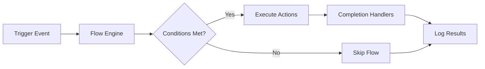
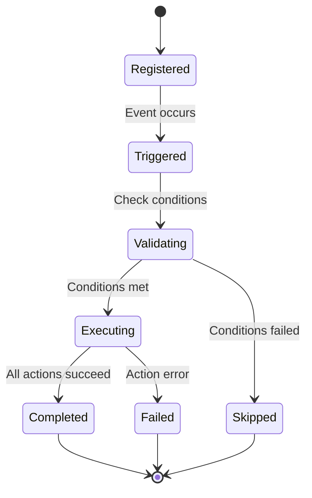

# Flow Automation System

The Flow Automation Engine is VAutomationCore's flagship feature - a powerful, event-driven system that enables you to create complex automation pipelines using simple JSON configuration.

---

## 🌊 What is a Flow?

A **flow** is a sequence of **actions** triggered by specific **events**. Think of it as a recipe:

```
Trigger → Conditions → Actions → Completion Handlers
```

### **Core Components**

* **Triggers** - Events that start the flow (zone entry, commands, time-based)
* **Conditions** - Optional logic that determines if the flow should execute
* **Actions** - The actual operations performed (messages, spawning, state changes)
* **Completion Handlers** - Optional cleanup or follow-up actions

---

## 🏗️ Architecture Overview



### **Data Flow Example**

1. **Player enters arena zone**
2. **Flow Engine** matches `zone.enter` trigger
3. **Conditions** check player level >= 10
4. **Actions** execute: welcome message, apply buff, enable PvP
5. **Completion** logs successful execution

---

## 📝 Where Flows Live

Flows are defined in JSON configuration files:

```
config/VAutomationCore/
├── automation_rules.json     # Primary flow definitions
├── commands.json            # Dynamic command flows
└── zones.json              # Zone definitions referenced by flows
```

### **Hot Reloading**

Flows support hot reloading - modify the JSON file and the system will automatically update without server restart.

---

## 🎯 Key Benefits

### **For Server Administrators**
* **No coding required** for common automations
* **Real-time updates** without server downtime
* **Consistent behavior** across all mods using VAutomationCore

### **For Mod Developers**
* **Rapid prototyping** of complex game logic
* **Reusable components** across different mods
* **Safe execution** with built-in error handling and rollback

### **For Players**
* **Dynamic world events** that respond to their actions
* **Consistent experiences** across different servers
* **Rich gameplay** with automated systems

---

## 🔄 Flow Lifecycle



### **States Explained**

* **Registered** - Flow is loaded and ready to trigger
* **Triggered** - Event occurred that matches flow's trigger
* **Validating** - Checking if conditions are met
* **Executing** - Running the flow's actions
* **Completed** - All actions executed successfully
* **Failed** - One or more actions failed
* **Skipped** - Conditions were not met

---

## 🚀 Quick Example

```json
{
  "flows": {
    "arena_welcome": {
      "triggers": [
        { "type": "zone.enter", "zone": "arena" }
      ],
      "conditions": [
        { "type": "player.level", "operator": ">=", "value": 10 }
      ],
      "actions": [
        { "action": "zone.message", "message": "⚔️ Welcome to the Arena!" },
        { "action": "zone.setpvp", "value": true },
        { "action": "player.applybuff", "buff": "arena_entrance", "duration": 300 }
      ],
      "on_complete": [
        { "action": "zone.log", "message": "Arena welcome flow completed" }
      ]
    }
  }
}
```

This single flow demonstrates:
* **Zone-based triggering**
* **Conditional execution**
* **Multiple actions**
* **Completion handling**

---

## 📊 Performance Characteristics

VAutomationCore's Flow Engine is optimized for high-performance server environments:

| Metric | Performance | Notes |
|--------|-------------|-------|
| **Trigger Processing** | < 1ms | Event to flow matching |
| **Condition Evaluation** | < 0.5ms | Simple logic checks |
| **Action Execution** | 1-10ms | Depends on action complexity |
| **Memory Overhead** | < 1KB per flow | Minimal footprint |
| **Concurrent Flows** | 100+ | Limited by config |

---

## 🛡️ Safety Features

### **Error Isolation**
* Failed actions don't crash the server
* Each action runs in a protected context
* Detailed error logging for debugging

### **Transaction Support**
* Actions can be grouped into transactions
* Automatic rollback on failure
* Consistent state guarantees

### **Resource Limits**
* Configurable maximum concurrent flows
* Action timeout protection
* Memory usage monitoring

---

## 🎮 Integration Points

Flows integrate seamlessly with other VAutomationCore systems:

### **Game Action Service**
```json
{ "action": "zone.message", "message": "Hello!" }
```

### **ECS Utilities**
```json
{ "action": "ecs.query", "type": "Player", "filter": "health<50" }
```

### **Dynamic Commands**
```json
{ "action": "command.execute", "name": "spawnboss", "args": {...} }
```

### **Cross-Mod Communication**
```json
{ "action": "mod.send", "target": "OtherMod", "event": "BossDefeated" }
```

---

## 🔧 Advanced Features

### **Template Variables**
Use dynamic data in your actions:

```json
{
  "action": "zone.message",
  "message": "Welcome {{player_name}}! You are level {{player_level}}."
}
```

### **Delayed Actions**
Schedule actions for later execution:

```json
{
  "action": "zone.message",
  "message": "Battle starts in 10 seconds!",
  "delay": 10000
}
```

### **Parallel Execution**
Run multiple actions simultaneously:

```json
{
  "actions": [
    { "action": "spawn.boss", "parallel": true },
    { "action": "zone.setpvp", "parallel": true },
    { "action": "zone.message", "parallel": true }
  ]
}
```

---

## 📚 Next Steps

Ready to dive deeper?

* **[Configuration Format](configuration-format.md)** - Detailed JSON schema
* **[Triggers](triggers.md)** - All available trigger types
* **[Actions](actions.md)** - Complete action catalog
* **[Debugging](debugging-flows.md)** - Troubleshooting guide

---

## 💡 Pro Tips

### **Design Principles**
1. **Keep flows simple** - Single responsibility per flow
2. **Use descriptive names** - `arena_welcome` not `flow1`
3. **Log important events** - Always include completion handlers
4. **Test incrementally** - Start simple, add complexity

### **Performance Tips**
1. **Avoid expensive actions** in hot triggers
2. **Use conditions** to filter unnecessary executions
3. **Batch related actions** when possible
4. **Monitor flow metrics** in production

---

<div align="center">

**[🔝 Back to Top](#flow-automation-system)** • [**← Documentation Home**](../index.md)** • **[Configuration Format →](configuration-format.md)**

</div>
