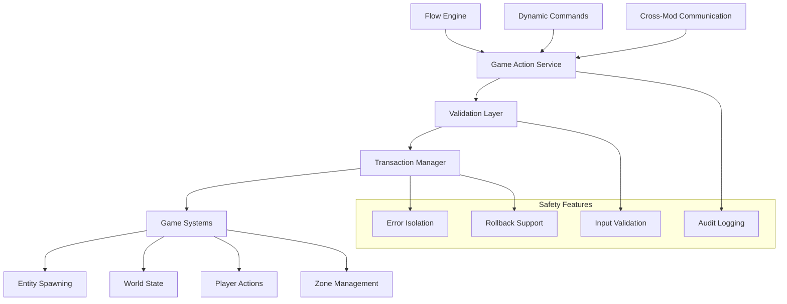

# Game Action Service

The Game Action Service is VAutomationCore's central hub for safe gameplay operations. It provides a unified, secure interface for interacting with V Rising's game systems while protecting server stability and ensuring consistent behavior.

---

## 🎮 What is the Game Action Service?

The Game Action Service abstracts away the complexity and danger of direct game manipulation. Instead of working with raw ECS components or game APIs, you use safe, validated operations that:

* **Prevent server crashes** through input validation and error handling
* **Ensure consistency** across different mods and contexts
* **Provide transactions** for multi-step operations with rollback
* **Enable auditing** of all gameplay modifications

---

## 🛡️ Why Use It Instead of Direct ECS?

| Direct ECS | Game Action Service |
|------------|---------------------|
| ❌ Risk of server crashes | ✅ Safe error handling |
| ❌ No validation | ✅ Input sanitization |
| ❌ No transaction support | ✅ Atomic operations |
| ❌ Hard to debug | ✅ Detailed logging |
| ❌ Inconsistent behavior | ✅ Standardized interface |

---

## 🏗️ Architecture Overview



---

## 🎯 Core Operations

### **Entity Management**

```csharp
// Safe entity spawning
var spawnedEntities = await GameActionService.SpawnEntitiesAsync(
    prefab: PrefabGUID.Wolf,
    position: new Vector3(0, 0, 0),
    count: 5,
    context: new SpawnContext { Zone = "forest_area" }
);

// Safe entity removal
var removed = await GameActionService.RemoveEntitiesAsync(
    entities: markedEntities,
    reason: "Arena cleanup"
);
```

### **World State Modification**

```csharp
// Zone PvP toggle
await GameActionService.SetZonePvPAsync("arena", true);

// Time of day control
await GameActionService.SetTimeOfDayAsync(TimeOfDay.Night);

// World buffs
await GameActionService.ApplyWorldBuffAsync("blood_moon_power", duration: 3600);
```

### **Player Interactions**

```csharp
// Send messages
await GameActionService.SendMessageToPlayerAsync(playerEntity, "Welcome to the arena!");

// Apply buffs
await GameActionService.ApplyBuffAsync(playerEntity, BuffPrefab.ArenaBuff, duration: 300);

// Modify player stats
await GameActionService.ModifyPlayerStatAsync(playerEntity, PlayerStat.Health, -10);
```

---

## 🔄 Transaction System

Transactions ensure that multi-step operations either complete successfully or roll back entirely, preventing inconsistent game states.

### **Basic Transaction Pattern**

```csharp
using var transaction = GameActionService.BeginTransaction();
try
{
    // Step 1: Enable PvP in arena
    await GameActionService.SetZonePvPAsync("arena", true);
    
    // Step 2: Spawn boss wave
    await GameActionService.SpawnEntitiesAsync(bossPrefab, arenaCenter, count: 3);
    
    // Step 3: Apply arena buff to all players
    var players = ECS.Query<PlayerCharacter>().WithinZone("arena").Execute();
    foreach (var player in players)
    {
        await GameActionService.ApplyBuffAsync(player, arenaBuff, duration: 300);
    }
    
    // Commit all changes
    await transaction.CommitAsync();
    Logger.Info("Arena setup completed successfully");
}
catch (Exception ex)
{
    // Automatic rollback on any failure
    Logger.Error($"Arena setup failed: {ex.Message}");
    // transaction.RollbackAsync() is called automatically
}
```

### **Transaction Features**

* **Atomic Operations** - All steps succeed or none do
* **Automatic Rollback** - Failed operations undo previous changes
* **Timeout Protection** - Long-running transactions are automatically cancelled
* **Nested Transactions** - Support for complex operation hierarchies

---

## 📡 Service Integration

The Game Action Service integrates seamlessly with other VAutomationCore systems:

### **Flow Integration**

```json
{
  "action": "game.spawn_entities",
  "prefab": "vampire_lord",
  "position": { "x": 0, "y": 0, "z": 0 },
  "count": 1,
  "context": { "zone": "arena" }
}
```

### **Command Integration**

```csharp
[Command("spawnboss", "Spawn a boss at your location")]
public class SpawnBossCommand
{
    public async Task ExecuteAsync(CommandContext ctx)
    {
        await GameActionService.SpawnEntitiesAsync(
            prefab: bossPrefab,
            position: ctx.Player.Position,
            count: 1
        );
        
        await ctx.ReplyAsync("Boss spawned!");
    }
}
```

### **Cross-Mod Integration**

```csharp
// Other mods can safely request actions
var result = await ModCommunication.ExecuteCommandAsync(
    targetMod: "VAutomationCore",
    command: "game.spawn_entities",
    parameters: new { prefab = "wolf", count = 5 }
);
```

---

## 🔧 Configuration

Game Action Service behavior can be configured:

```json
{
  "game_actions": {
    "enable_transactions": true,
    "transaction_timeout": 30000,
    "max_concurrent_operations": 100,
    "enable_audit_logging": true,
    "validation_level": "strict"
  }
}
```

### **Configuration Options**

| Setting | Default | Description |
|---------|---------|-------------|
| `enable_transactions` | true | Enable transaction support |
| `transaction_timeout` | 30000 | Transaction timeout in milliseconds |
| `max_concurrent_operations` | 100 | Maximum concurrent operations |
| `enable_audit_logging` | true | Log all game modifications |
| `validation_level` | strict | Input validation strictness |

---

## 📊 Performance Characteristics

| Operation | Performance | Notes |
|-----------|-------------|-------|
| **Entity Spawn** | 5-50ms | Depends on entity complexity |
| **Zone Modification** | 1-5ms | Simple state changes |
| **Player Message** | < 1ms | Network-bound |
| **Transaction Commit** | 10-100ms | Depends on operations |
| **Rollback** | 20-200ms | Depends on complexity |

---

## 🛡️ Safety Features

### **Input Validation**

```csharp
// Automatic validation prevents invalid operations
try {
    await GameActionService.SpawnEntitiesAsync(
        prefab: invalidPrefab, // Will be validated
        position: new Vector3(float.NaN, 0, 0), // Will be rejected
        count: -1 // Will be clamped to valid range
    );
}
catch (ValidationException ex) {
    Logger.Error($"Invalid parameters: {ex.Message}");
}
```

### **Error Isolation**

Failed operations don't affect other systems:

```csharp
// This won't crash the server if spawning fails
var result = await GameActionService.SpawnEntitiesAsync(prefab, position, count);
if (!result.Success) {
    Logger.Warning($"Spawn failed: {result.ErrorMessage}");
    // Server continues running normally
}
```

### **Audit Logging**

All operations are logged for security and debugging:

```
[INFO] GameActionService: Spawned 5 entities of type Wolf at (0,0,0)
[INFO] GameActionService: Set PvP enabled for zone: arena
[WARNING] GameActionService: Failed to spawn entity: Invalid prefab GUID
[AUDIT] GameActionService: User Admin modified player health by -10
```

---

## 🎮 Use Cases

### **Arena System**

```csharp
public class ArenaSystem
{
    public async Task StartArena()
    {
        using var transaction = GameActionService.BeginTransaction();
        
        // Setup arena environment
        await GameActionService.SetZonePvPAsync("arena", true);
        await GameActionService.ClearZoneAsync("arena");
        await GameActionService.SpawnEntitiesAsync(bossPrefab, arenaCenter, 1);
        
        // Notify players
        await GameActionService.BroadcastToZoneAsync("arena", "⚔️ Arena Battle Starting!");
        
        await transaction.CommitAsync();
    }
}
```

### **Dynamic World Events**

```csharp
public class BloodMoonEvent
{
    public async Task StartBloodMoon()
    {
        // Global modifications
        await GameActionService.SetTimeOfDayAsync(TimeOfDay.Night);
        await GameActionService.ApplyWorldBuffAsync("blood_moon_power", 3600);
        
        // Spawn enhanced enemies
        var spawnPoints = GetSpawnPoints();
        foreach (var point in spawnPoints)
        {
            await GameActionService.SpawnEntitiesAsync(enhancedVampire, point, 3);
        }
        
        // Global notification
        await GameActionService.BroadcastToAllAsync("🌕 Blood Moon Rises!");
    }
}
```

---

## 🔍 Debugging and Monitoring

### **Operation Tracking**

```csharp
// Enable detailed operation logging
GameActionService.SetLogLevel(LogLevel.Debug);

// Track operation performance
var stopwatch = Stopwatch.StartNew();
var result = await GameActionService.SpawnEntitiesAsync(prefab, position, count);
stopwatch.Stop();

Logger.Info($"Operation completed in {stopwatch.ElapsedMilliseconds}ms: " +
          $"Success={result.Success}, Entities={result.EntitiesSpawned}");
```

### **Health Monitoring**

```csharp
// Get service health status
var health = GameActionService.GetHealthStatus();
Logger.Info($"Active operations: {health.ActiveOperations}");
Logger.Info($"Pending transactions: {health.PendingTransactions}");
Logger.Info($"Total operations: {health.TotalOperations}");
```

---

## 📚 Best Practices

### **Transaction Usage**
1. **Group related operations** - Use transactions for multi-step changes
2. **Keep transactions short** - Avoid long-running transactions
3. **Handle failures gracefully** - Always catch and log transaction errors
4. **Test rollback scenarios** - Verify rollback behavior works correctly

### **Performance Optimization**
1. **Batch operations** - Modify multiple entities in one call
2. **Use appropriate contexts** - Provide zone and context information
3. **Monitor operation times** - Watch for slow operations
4. **Cache frequently used data** - Reduce repeated calculations

### **Security Considerations**
1. **Validate all inputs** - Never trust user-provided data
2. **Use permission checks** - Verify user authorization
3. **Log sensitive operations** - Track important modifications
4. **Implement rate limiting** - Prevent abuse of operations

---

## 🚀 Advanced Features

### **Custom Actions**

```csharp
// Register custom game actions
GameActionService.RegisterAction("custom.arena_teleport", async (args) => {
    var zone = args["zone"].ToString();
    var targetZone = ZoneService.GetZone(zone);
    
    if (targetZone != null) {
        await GameActionService.TeleportToZoneAsync(args["player"], zone);
        return OperationResult.Success();
    }
    
    return OperationResult.Error("Zone not found");
});
```

### **Operation Hooks**

```csharp
// Add pre/post operation hooks
GameActionService.AddPreHook(async (operation) => {
    Logger.Info($"About to execute: {operation.Type}");
    // Add custom validation or logging
});

GameActionService.AddPostHook(async (operation, result) => {
    Logger.Info($"Operation completed: {operation.Type} - Success: {result.Success}");
    // Add custom post-processing
});
```

---

## 📖 Next Steps

Ready to dive deeper?

* **[Spawning and Despawning](spawning-and-despawning.md)** - Entity management guide
* **[World State Modification](modifying-world-state.md)** - Environment control
* **[Transactions Deep Dive](transactions.md)** - Advanced transaction patterns

---

<div align="center">

**[🔝 Back to Top](#game-action-service)** • [**← Documentation Home**](../index.md)** • **[Spawning Guide →](spawning-and-despawning.md)**

</div>
