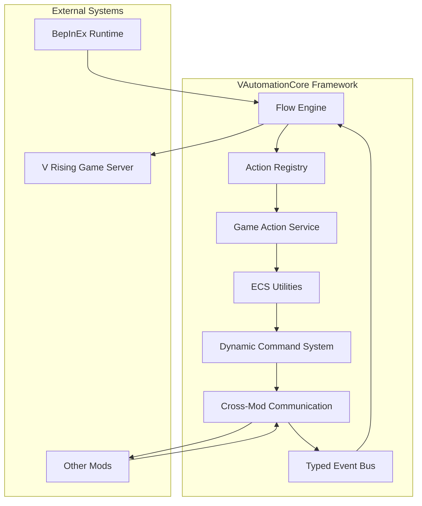

# VAutomationCore Documentation

<div align="center">

**Enterprise-grade automation and ECS utility framework for V Rising server mods**

[](https://opensource.org/licenses/MIT)
[](https://www.nuget.org/packages/VAutomationCore/)

</div>

---

## 🌟 What is VAutomationCore?

VAutomationCore is a **comprehensive automation framework** designed specifically for V Rising server modifications. It provides developers with enterprise-grade tools for building complex, event-driven automation systems, ECS utilities, and cross-mod communication protocols.

### 🎯 Key Features

* **🔄 Flow Automation Engine** - Event-driven automation pipelines with JSON configuration
* **🧬 ECS Utilities** - Safe, optimized helpers for V Rising's Entity Component System
* **⚙️ Action Registry** - Extensible action system with parameter validation
* **🎮 Game Action Service** - Centralized safe gameplay operations with transactions
* **🧾 Dynamic Command System** - Runtime command registration and management
* **🔗 Cross-Mod Communication** - Inter-mod messaging and service discovery
* **📡 Typed Event Bus** - Type-safe event system for mod communication

### 👥 Who It's For

* **Server Administrators** looking to automate complex gameplay scenarios
* **Mod Developers** building interconnected mod ecosystems
* **Game Designers** creating dynamic world events and systems
* **System Architects** designing scalable server automation

---

## 🚀 Quick Links

### 📖 Getting Started
* [**Installation**](getting-started/installation.md) - Setup and requirements
* [**First Flow**](getting-started/first-flow.md) - Create your first automation
* [**First Command**](getting-started/first-command.md) - Dynamic command basics
* [**Folder Layout**](getting-started/folder-layout.md) - Project structure

### 🔧 Core Systems
* [**Flows**](flows/overview.md) - Automation system
* [**ECS Utilities**](ecs/overview.md) - Entity Component System helpers
* [**Game Action Service**](game-actions/overview.md) - Safe gameplay operations
* [**Commands**](commands/overview.md) - Dynamic command system
* [**Cross-Mod Communication**](communication/overview.md) - Inter-mod messaging
* [**Events**](events/overview.md) - Typed event bus

### 📚 Advanced Topics
* [**Configuration**](configuration/overview.md) - System configuration
* [**Performance**](performance/overview.md) - Optimization and scaling
* [**Security**](security/overview.md) - Safety and security features
* [**Advanced Examples**](advanced/overview.md) - Complex implementations

### 📖 Reference
* [**API Reference**](reference/api-reference.md) - Complete API documentation
* [**Glossary**](reference/glossary.md) - Key terms and concepts
* [**Migration Guide**](migration/versioning-policy.md) - Version compatibility

---

## 🏗️ Architecture Overview



---

## 🎯 Learning Path

### 🌱 **Beginner** (New to VAutomationCore)
1. [Installation](getting-started/installation.md) - Get setup quickly
2. [First Flow](getting-started/first-flow.md) - Basic automation
3. [First Command](getting-started/first-command.md) - Dynamic commands
4. [Configuration Basics](configuration/overview.md) - System setup

### 🚀 **Intermediate** (Familiar with the basics)
1. [Flow System](flows/overview.md) - Advanced automation
2. [ECS Utilities](ecs/overview.md) - Entity operations
3. [Game Actions](game-actions/overview.md) - Safe operations
4. [Event System](events/overview.md) - Event-driven architecture

### 🔥 **Advanced** (Building complex systems)
1. [Cross-Mod Communication](communication/overview.md) - Mod ecosystems
2. [Performance Optimization](performance/overview.md) - Scaling solutions
3. [Security & Safety](security/overview.md) - Production deployment
4. [Advanced Examples](advanced/overview.md) - Real-world implementations

---

## 💡 Quick Examples

### 🔄 Simple Flow
```json
{
  "flows": {
    "arena_welcome": {
      "triggers": [
        { "type": "zone.enter", "zone": "arena" }
      ],
      "actions": [
        { "action": "zone.message", "message": "⚔️ Welcome to the Arena!" }
      ]
    }
  }
}
```

### 🧬 ECS Query
```csharp
// Find all players in a specific zone
var playersInZone = ECS.Query<PlayerCharacter>()
    .WithinZone("castle_area")
    .WithHealthBelow(50)
    .Execute();
```

### 🎮 Safe Game Action
```csharp
// Safe entity spawning with transaction support
using var transaction = GameActionService.BeginTransaction();
await GameActionService.SpawnEntitiesAsync(
    prefab: PrefabGUID.Wolf,
    position: new Vector3(0, 0, 0),
    count: 5
);
await transaction.CommitAsync();
```

---

## 🌟 Community & Support

* **[Discord Community](https://discord.gg/uJ2ehWv4gR)** - Real-time support and discussions
* **[GitHub Issues](https://github.com/Coyoteq1/VAutomationCore/issues)** - Bug reports and feature requests
* **[GitHub Discussions](https://github.com/Coyoteq1/VAutomationCore/discussions)** - Questions and ideas

---

## 📖 Next Steps

Ready to dive in? Start with our [**Installation Guide**](getting-started/installation.md) to get VAutomationCore running on your server.

For experienced developers, jump directly to the [**Flow System**](flows/overview.md) or [**ECS Utilities**](ecs/overview.md) documentation.

---

<div align="center">

**[🔝 Back to Top](#-vautomationcore-documentation)**

Made with ❤️ by [Coyoteq1](https://github.com/Coyoteq1)

*Building the future of V Rising automation*

</div>
