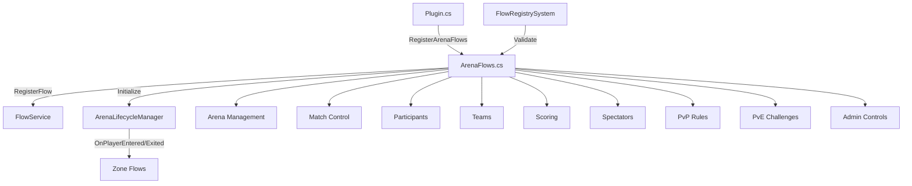

# ArenaFlows Comprehensive Implementation Plan

## Overview
Create a complete ArenaFlows.cs system for PvP Combat Arena, PvE Challenge Arena, and Mixed Arena functionality with disable/enable options for all flows.

## Current State Analysis

### Existing Components
- **ArenaLifecycleManager.cs** - Basic player enter/exit handling (55 lines)
- **ZoneFlows.cs** - 33 zone management flows (sunblockers, restrictions, transitions)
- **ZoneRulesFlows.cs** - 31 zone rule flows (PVP/combat rules, enforcement, admin controls)

### What's Missing
- No dedicated ArenaFlows.cs file
- No arena creation/management flows
- No match control (start/stop/pause/reset)
- No participant/team management
- No spectator system flows
- No scoring/rewards flows
- No arena state management
- No arena disable/enable flow controls

## Implementation Plan

### 1. Create ArenaFlows.cs
**Location:** `Core/Flows/ArenaFlows.cs`

**Flow Categories (55+ flows):**

#### A. Arena Management Flows (10 flows)
| Flow Name | Description |
|-----------|-------------|
| `arena_create` | Create new arena with name, type, location |
| `arena_delete` | Delete existing arena |
| `arena_configure` | Configure arena settings (type, max players, duration) |
| `arena_list` | List all available arenas |
| `arena_info` | Get detailed arena information |
| `arena_rename` | Rename an arena |
| `arena_set_type` | Set arena type (PvP/PvE/Mixed) |
| `arena_set_location` | Set arena spawn point location |
| `arena_set_max_players` | Set maximum players allowed |
| `arena_set_duration` | Set match duration |

#### B. Arena Enable/Disable Flows (10 flows)
| Flow Name | Description |
|-----------|-------------|
| `arena_enable` | Enable a specific arena |
| `arena_disable` | Disable a specific arena |
| `arena_enable_all` | Enable all arenas (admin) |
| `arena_disable_all` | Disable all arenas (admin) |
| `arena_enable_type` | Enable arenas by type |
| `arena_disable_type` | Disable arenas by type |
| `arena_toggle` | Toggle arena on/off |
| `arena_set_state` | Set arena state (active/inactive/maintenance) |
| `arena_maintenance_mode` | Set arena to maintenance mode |
| `arena_emergency_close` | Emergency close all arenas |

#### C. Match Control Flows (10 flows)
| Flow Name | Description |
|-----------|-------------|
| `arena_match_start` | Start a match in an arena |
| `arena_match_stop` | Stop a running match |
| `arena_match_pause` | Pause a running match |
| `arena_match_resume` | Resume a paused match |
| `arena_match_reset` | Reset match state |
| `arena_match_force_end` | Force end match |
| `arena_countdown_start` | Start match countdown |
| `arena_countdown_cancel` | Cancel countdown |
| `arena_round_start` | Start new round |
| `arena_round_end` | End current round |

#### D. Participant Management Flows (10 flows)
| Flow Name | Description |
|-----------|-------------|
| `arena_join` | Player joins an arena |
| `arena_leave` | Player leaves an arena |
| `arena_kick` | Kick player from arena |
| `arena_ban` | Ban player from arena |
| `arena_unban` | Unban player from arena |
| `arena_spectate` | Player enters spectate mode |
| `arena_spectator_join` | Player joins as spectator |
| `arena_spectator_leave` | Player leaves spectate mode |
| `arena_team_assign` | Assign player to team |
| `arena_team_create` | Create team in arena |

#### E. Team Management Flows (8 flows)
| Flow Name | Description |
|-----------|-------------|
| `arena_team_1` | Assign to team 1 |
| `arena_team_2` | Assign to team 2 |
| `arena_team_auto` | Auto-assign to team |
| `arena_team_balanced` | Balanced team assignment |
| `arena_team_swap` | Swap players between teams |
| `arena_team_balance` | Force team balance |
| `arena_team_ready` | Mark team as ready |
| `arena_team_count` | Get team player count |

#### F. Scoring & Rewards Flows (10 flows)
| Flow Name | Description |
|-----------|-------------|
| `arena_score_add` | Add points to player/team |
| `arena_score_subtract` | Subtract points |
| `arena_score_set` | Set specific score |
| `arena_score_get` | Get current score |
| `arena_leaderboard_update` | Update leaderboard |
| `arena_leaderboard_get` | Get leaderboard |
| `arena_reward_give` | Give reward to winner |
| `arena_reward_distribute` | Distribute rewards to participants |
| `arena_kill_count` | Track player kills |
| `arena_death_count` | Track player deaths |

#### G. Spectator Flows (8 flows)
| Flow Name | Description |
|-----------|-------------|
| `spectator_mode_enable` | Enable spectator mode |
| `spectator_mode_disable` | Disable spectator mode |
| `spectator_follow` | Spectator follows player |
| `spectator_free_cam` | Free camera mode |
| `spectator_list` | List spectators |
| `spectator_chat_enable` | Enable spectator chat |
| `spectator_chat_disable` | Disable spectator chat |
| `spectator_broadcast` | Broadcast message to spectators |

#### H. PvP-Specific Flows (8 flows)
| Flow Name | Description |
|-----------|-------------|
| `arena_pvp_enable` | Enable PvP in arena |
| `arena_pvp_disable` | Disable PvP in arena |
| `arena_pvp_toggle` | Toggle PvP state |
| `arena_friendly_fire_enable` | Enable friendly fire |
| `arena_friendly_fire_disable` | Disable friendly fire |
| `arena_respawn_enable` | Enable respawning |
| `arena_respawn_disable` | Disable respawning |
| `arena_respawn_timer_set` | Set respawn timer |

#### I. PvE/Challenge Flows (8 flows)
| Flow Name | Description |
|-----------|-------------|
| `arena_pve_enable` | Enable PvE mode |
| `arena_pve_disable` | Disable PvE mode |
| `arena_wave_start` | Start wave |
| `arena_wave_end` | End wave |
| `arena_wave_number_set` | Set current wave |
| `arena_boss_spawn` | Spawn boss |
| `arena_difficulty_set` | Set difficulty level |
| `arena_spawn_enemy` | Spawn enemy entity |

#### J. Admin Control Flows (10 flows)
| Flow Name | Description |
|-----------|-------------|
| `arena_admin_force_start` | Admin force start |
| `arena_admin_force_stop` | Admin force stop |
| `arena_admin_teleport` | Admin teleport to arena |
| `arena_admin_heal` | Admin heal all players |
| `arena_admin_reset_cooldowns` | Reset all cooldowns |
| `arena_admin_give_loadout` | Give loadout to players |
| `arena_admin_set_time` | Set match time |
| `arena_admin_unlock_abilities` | Unlock all abilities |
| `arena_admin_toggle_god_mode` | Toggle god mode |
| `arena_admin_override_rules` | Override arena rules |

### 2. Update VAutomationCore.csproj
Add ArenaFlows.cs to compilation:
```xml
<Compile Include="Core\Flows\ArenaFlows.cs" />
```

### 3. Update Plugin.cs
Add registration in flow registration section:
```csharp
ArenaFlows.RegisterArenaFlows();
```

### 4. Update FlowRegistrySystem.cs
- Add `Arena` to FlowDomain enum
- Add `RegisterArenaFlows()` method
- Register all arena flows with metadata

## Integration Architecture



## Parameter Requirements

All arena flows should support these parameter types from FlowComponents:

| Parameter | Type | Required | Default |
|-----------|------|----------|---------|
| `arena_id` | string | Yes | - |
| `arena_name` | string | No | - |
| `arena_type` | string | No | "pvp" |
| `player` | Entity | Yes | - |
| `team` | int | No | 0 |
| `score` | int | No | 0 |
| `duration` | float | No | 300.0 |
| `position` | float3 | No | (0,0,0) |
| `enabled` | bool | No | true |
| `admin` | Entity | Yes* | - |

## Disable/Enable Flow Pattern

Each flow category should have enable/disable pairs:
- `arena_enable` / `arena_disable` - Master toggle
- `arena_pvp_enable` / `arena_pvp_disable` - PvP rules
- `arena_respawn_enable` / `arena_respawn_disable` - Respawning
- `spectator_mode_enable` / `spectator_mode_disable` - Spectators
- `arena_friendly_fire_enable` / `arena_friendly_fire_disable` - Friendly fire
- `arena_pve_enable` / `arena_pve_disable` - PvE mode

## Execution Order

1. Create ArenaFlows.cs with all flow definitions
2. Update VAutomationCore.csproj
3. Update Plugin.cs registration
4. Update FlowRegistrySystem
5. Test compilation

## Success Criteria

- [ ] ArenaFlows.cs contains 70+ flows
- [ ] All flows have enable/disable pairs where applicable
- [ ] Integration with existing ZoneFlows for zone-based arenas
- [ ] Integration with ArenaLifecycleManager for lifecycle events
- [ ] Admin controls for global arena management
- [ ] PvP, PvE, and Mixed arena types supported
