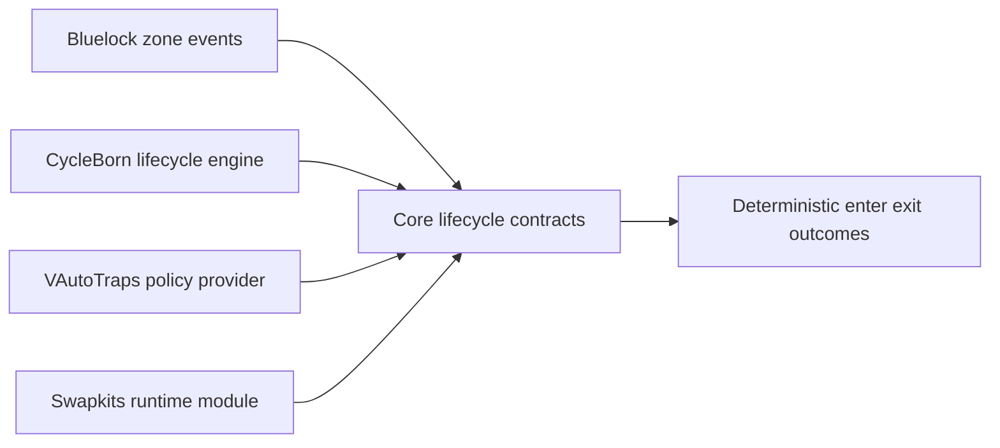

# Bluelock CycleBorn Swapkits VAutoTraps Refactor and Stabilization Plan

## Scope

Target modules:

- `Bluelock` plugin in [`Bluelock/Plugin.cs`](../Bluelock/Plugin.cs)
- `CycleBorn` plugin in [`CycleBorn/Plugin.cs`](../CycleBorn/Plugin.cs)
- `Swapkits` plugin in [`Swapkits/Plugin.cs`](../Swapkits/Plugin.cs)
- `VAutoTraps` plugin in [`VAutoTraps/Plugin.cs`](../VAutoTraps/Plugin.cs)
- shared contracts in [`VAutomationCore.csproj`](../VAutomationCore.csproj)

Primary objective: stabilize cross-plugin integration and lifecycle correctness while reducing coupling and drift between modules.

## Current State Snapshot

### Dependency and ownership signals

- `Bluelock` explicitly depends on lifecycle via `[BepInDependency]` in [`Plugin`](../Bluelock/Plugin.cs).
- `CycleBorn` depends on core and VCF, and contains lifecycle integration flags in [`Plugin`](../CycleBorn/Plugin.cs).
- `VAutoTraps` depends on core and VCF with its own trap runtime and command surface in [`TrapCommands`](../VAutoTraps/Commands/Core/TrapCommands.cs).
- `Swapkits` is currently unstable:
  - plugin metadata and logging assignment issues in [`ExtraSlotsPlugin`](../Swapkits/Plugin.cs)
  - no visible command registration call in [`ExtraSlotsPlugin.Load`](../Swapkits/Plugin.cs)
  - suspicious `[BepInDependency]` usage attached to [`ExtraSlotsPlugin.Update`](../Swapkits/Plugin.cs)

### Integration and correctness hotspots

- dual trap override switches exist in both [`Bluelock/Plugin.cs`](../Bluelock/Plugin.cs) and [`CycleBorn/Plugin.cs`](../CycleBorn/Plugin.cs)
- lifecycle manager trap decision path references resolver APIs in [`ArenaLifecycleManager`](../CycleBorn/Services/Lifecycle/ArenaLifecycleManager.cs)
- resolver/contract definitions are not visible in `Core` compile set from [`VAutomationCore.csproj`](../VAutomationCore.csproj)
- command surface fragmentation across modules:
  - zone and match commands in [`Bluelock/Commands/Core`](../Bluelock/Commands/Core)
  - lifecycle commands in [`CycleBorn/Commands`](../CycleBorn/Commands)
  - trap commands in [`VAutoTraps/Commands/Core/TrapCommands.cs`](../VAutoTraps/Commands/Core/TrapCommands.cs)
  - extra-slot commands in [`Swapkits/Commands/InventoryCommands.cs`](../Swapkits/Commands/InventoryCommands.cs)

## Target Architecture Direction

Design intent:

1. Shared integration contracts are defined once in core.
2. Runtime plugins consume contracts through interfaces and capability checks.
3. Lifecycle enter and exit behavior is deterministic regardless of plugin load order.
4. Command and configuration behavior is consistent and auditable.

## Execution Plan

## Phase 1 - Establish baseline guardrails

1. Add or expand architecture guardrail tests to validate allowed cross-project references in [`tests/Bluelock.Tests/ArchitectureGuardrailTests.cs`](../tests/Bluelock.Tests/ArchitectureGuardrailTests.cs).
2. Add startup diagnostics contract checks in each plugin bootstrap:
   - [`Bluelock/Plugin.cs`](../Bluelock/Plugin.cs)
   - [`CycleBorn/Plugin.cs`](../CycleBorn/Plugin.cs)
   - [`VAutoTraps/Plugin.cs`](../VAutoTraps/Plugin.cs)
   - [`Swapkits/Plugin.cs`](../Swapkits/Plugin.cs)
3. Define unified startup log schema and emit dependency status, command registration status, and integration flag status.

Deliverable: reproducible baseline report showing module readiness and integration status at startup.

## Phase 2 - Normalize shared lifecycle integration contracts

1. Introduce or relocate trap lifecycle integration contracts into core compile surface under [`Core/`](../Core) and include via [`VAutomationCore.csproj`](../VAutomationCore.csproj).
2. Ensure `CycleBorn` consumes only shared interfaces for trap lifecycle decisions in [`CycleBorn/Services/Lifecycle/ArenaLifecycleManager.cs`](../CycleBorn/Services/Lifecycle/ArenaLifecycleManager.cs).
3. Ensure `VAutoTraps` registers policy overrides only through shared contract APIs and never through direct project references.
4. Remove duplicate or divergent local definitions if found.

Deliverable: one contract path for trap lifecycle overrides with deterministic resolver behavior.

## Phase 3 - Lifecycle correctness hardening

1. Validate and standardize enter and exit sequencing between zone transitions and lifecycle transitions:
   - trigger sources in [`Bluelock/Services/ZoneTrackingService.cs`](../Bluelock/Services/ZoneTrackingService.cs)
   - lifecycle orchestration in [`CycleBorn/Services/Lifecycle/ArenaLifecycleManager.cs`](../CycleBorn/Services/Lifecycle/ArenaLifecycleManager.cs)
2. Define explicit precedence rules for trap overrides versus lifecycle actions.
3. Add safety behavior for missing resolver or disabled overrides so transitions still succeed.
4. Add regression tests for trap-related lifecycle decisions where feasible in [`tests/Bluelock.Tests`](../tests/Bluelock.Tests).

Deliverable: stable and testable enter and exit behavior under trap-enabled and trap-disabled configurations.

## Phase 4 - Swapkits stabilization and compatibility

1. Repair plugin bootstrap correctness in [`Swapkits/Plugin.cs`](../Swapkits/Plugin.cs):
   - fix logger initialization
   - normalize dependency attributes
   - register commands explicitly
2. Validate command namespace and collision safety for command attributes in [`Swapkits/Commands/InventoryCommands.cs`](../Swapkits/Commands/InventoryCommands.cs).
3. Align framework and target compatibility in [`Swapkits/Swapkits.csproj`](../Swapkits/Swapkits.csproj) with other plugins where required.
4. Add clear operational logs for cooldown, swap, and revive paths.

Deliverable: Swapkits loads reliably and exposes commands consistently in server runtime.

## Phase 5 - Configuration normalization

1. Map all integration toggles and remove semantic duplication:
   - [`Bluelock/Plugin.cs`](../Bluelock/Plugin.cs)
   - [`CycleBorn/Plugin.cs`](../CycleBorn/Plugin.cs)
   - [`VAutoTraps/Plugin.cs`](../VAutoTraps/Plugin.cs)
2. Define source-of-truth ownership for each setting category:
   - zone behavior
   - lifecycle behavior
   - trap override behavior
3. Standardize config file naming and startup reporting consistency.

Deliverable: predictable config precedence and reduced operator confusion.

## Phase 6 - Command surface and operability alignment

1. Build a command inventory and enforce naming and help consistency across:
   - [`Bluelock/Commands/Core`](../Bluelock/Commands/Core)
   - [`CycleBorn/Commands`](../CycleBorn/Commands)
   - [`VAutoTraps/Commands/Core/TrapCommands.cs`](../VAutoTraps/Commands/Core/TrapCommands.cs)
   - [`Swapkits/Commands/InventoryCommands.cs`](../Swapkits/Commands/InventoryCommands.cs)
2. Add a standard diagnostics command output contract per plugin.
3. Ensure admin-only and non-admin access patterns are deliberate and documented.

Deliverable: coherent operator command experience across all modules.

## Phase 7 - Rollout and verification

1. Implement staged rollout gates:
   - compile and static checks
   - local dedicated server plugin load
   - integration smoke pass for zone enter and exit, lifecycle hooks, trap policy behavior, and swapkit command paths
2. Capture final integration matrix in [`plans/`](.) and update docs in:
   - [`Bluelock/README.md`](../Bluelock/README.md)
   - [`CycleBorn/README.md`](../CycleBorn/README.md)
   - [`VAutoTraps/README.md`](../VAutoTraps/README.md)
3. Record unresolved debt as explicit backlog items.

Deliverable: documented and repeatable stabilization completion package.

## Priority Order for Implementation Mode

1. Phase 4 first if runtime is currently blocked by Swapkits bootstrap errors.
2. Otherwise run Phase 2 then Phase 3 to lock lifecycle correctness early.
3. Then run Phase 5 and Phase 6 for normalization and operational consistency.
4. End with Phase 7 verification and documentation updates.

## Definition of Done

- All four plugins load cleanly with clear startup diagnostics.
- Trap override lifecycle behavior is deterministic and contract-driven.
- Swapkits command paths are registered and functioning.
- Config ownership is unambiguous and documented.
- Guardrail tests and regression checks pass.

## Framework Quality Bar

To make this framework release-grade by objective standards, enforce these gates:

1. Build gate:
   `VAutomationCore`, `Bluelock`, `CycleBorn`, `VAutoTraps`, and `Swapkits` all compile in `Debug` and `Release`.
2. Contract gate:
   shared contracts (`Core/Lifecycle`, `Core/TrapLifecycle`, `Core/Api`) are present and consumed through project references only.
3. Dependency gate:
   no external extractor-style dependency patterns (`KindredExtract`, `ComponentExtractors`, `EntityDebug.RegisterExtractor`) in source or project files.
4. Authorization gate:
   role-based auth is core-owned; `Developer` role required for job flows, `Admin` alone cannot run jobs.
5. Regression gate:
   architecture guardrails + focused behavior tests must pass before publish.
