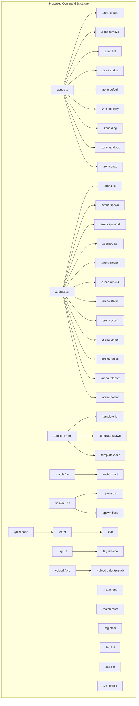

# Commands Alignment Plan

## Executive Summary

This plan addresses namespace inconsistencies, command group overlaps, and structural issues in the Bluelock command system. The goal is to create a unified, intuitive command hierarchy that aligns with the ECS-based zone detection and lifecycle management implemented in the recent code review.

## Current State Analysis

### Command Files and Their Issues

| File | Command Group | Namespace | Issues |
|------|---------------|-----------|--------|
| `ZoneCommands.cs` | `zone`, `z` | `VAuto.Zone.Commands` | Contains "arena" subcommands causing overlap |
| `ArenaEcsCommands.cs` | `arena`, `ar` | `Bluelock.Commands.Core` | **Duplicate namespace**, overlaps with ZoneCommands |
| `TemplateCommands.cs` | `template`, `tm` | `VAuto.Zone.Commands` | Good |
| `MatchCommands.cs` | `match`, `m` | `VAuto.Zone.Commands` | Good |
| `QuickZoneCommands.cs` | *(none - root level)* | `VAuto.Zone.Commands` | **Missing command group** |
| `TagCommands.cs` | `tag` | `VAuto.Commands.Core` | **Wrong namespace** (missing "Zone") |
| `SpawnCommands.cs` | `spawn`, `sp` | `VAuto.Zone.Commands` | Good |
| `VBloodUnlockCommands.cs` | *(none - root level)* | `VAuto.Commands.Core` | **Wrong namespace, missing group** |

### Identified Issues

1. **Namespace Inconsistency (3 different namespaces)**:
   - `VAuto.Zone.Commands` - majority of commands
   - `Bluelock.Commands.Core` - only ArenaEcsCommands
   - `VAuto.Commands.Core` - TagCommands, VBloodUnlockCommands

2. **Command Group Overlap**:
   - `ZoneCommands["zone"]` has subcommands: `arena create`, `arena remove`, `arena list`, `arena on`, `arena off`, `arena center`, `arena radius`, `arena tp`, `arena status`, `arena`, `arena holder`
   - `ArenaEcsCommands["arena"]` has commands: `list`, `spawn`, `spawnall`, `clear`, `clearall`, `rebuild`, `status`
   - **Conflict**: Both have `list` and `status` commands!

3. **Root-Level Commands**:
   - QuickZoneCommands: `.enter`, `.exit`
   - VBloodUnlockCommands: `.unlockprefab`, `.unlockprefab list`

## Proposed Alignment

### Namespace Standardization

All Bluelock commands should use: `VAuto.Zone.Commands`

### Command Group Hierarchy



### Rename Mapping

| Current | Proposed | Action |
|---------|----------|--------|
| `ZoneCommands["zone"]` | Keep as `zone` | Consolidate arena commands here |
| `ArenaEcsCommands["arena"]` | Keep as `arena` | Merge into single group, **change namespace** |
| `QuickZoneCommands` (root) | New group: `zone` | Add as subcommands under `zone enter`, `zone exit` |
| `TagCommands["tag"]` | Keep as `tag` | Change namespace to `VAuto.Zone.Commands` |
| `SpawnCommands["spawn"]` | Keep as `spawn` | Already correct |
| `TemplateCommands["template"]` | Keep as `template` | Already correct |
| `MatchCommands["match"]` | Keep as `match` | Already correct |
| `VBloodUnlockCommands` (root) | New group: `vblood` | Add command group |

## Implementation Steps

### Step 1: Fix Namespace Issues
- [ ] Move `ArenaEcsCommands.cs` from namespace `Bluelock.Commands.Core` to `VAuto.Zone.Commands`
- [ ] Move `TagCommands.cs` from namespace `VAuto.Commands.Core` to `VAuto.Zone.Commands`
- [ ] Move `VBloodUnlockCommands.cs` from namespace `VAuto.Commands.Core` to `VAuto.Zone.Commands`

### Step 2: Add Command Groups to Root-Level Commands
- [ ] Add `[CommandGroup("zone")]` to QuickZoneCommands (will register as `.zone enter`, `.zone exit`)
- [ ] Add `[CommandGroup("vblood", "vb")]` to VBloodUnlockCommands

### Step 3: Merge Duplicate Commands
- [ ] Resolve `ZoneCommands.arena list` vs `ArenaEcsCommands.list` conflict
- [ ] Resolve `ZoneCommands.arena status` vs `ArenaEcsCommands.status` conflict
- [ ] Choose single implementation for each and remove duplicate

### Step 4: Consolidate Arena Commands
- [ ] Move `arena create`, `arena remove`, `arena on`, `arena off`, `arena center`, `arena radius`, `arena teleport`, `arena holder` from ZoneCommands to ArenaEcsCommands
- [ ] Keep `help`, `default`, `identify`, `diag`, `sandbox`, `snap`, `kit verify` under ZoneCommands

### Step 5: Update QuickZoneCommands Integration
- [ ] After adding command group, update `.enter` to `.zone enter`
- [ ] Update `.exit` to `.zone exit`
- [ ] Update any documentation/references

### Step 6: Testing
- [ ] Verify all commands register correctly
- [ ] Verify no conflicts between command groups
- [ ] Test backward compatibility aliases if added

## Backward Compatibility Strategy

To maintain backward compatibility during transition:

1. **Add aliases** in VCF for renamed commands:
   ```csharp
   [Command("enter", "en", alias: ".enter", description: "...")]
   ```

2. **Log deprecation warnings** when old commands are used:
   ```csharp
   [Command("enter", "en", alias: ".enter")]
   public static void Enter(ChatCommandContext ctx, string zoneId = "")
   {
       ctx.Reply("Warning: '.enter' is deprecated. Use '.zone enter' instead.");
       // ... implementation
   }
   ```

3. **Version note**: Document breaking changes in changelog

## Runtime Mode Considerations

The new ECS-based zone detection (Legacy/Hybrid/EcsOnly) should be exposed via commands:

| Command | Description | Runtime Mode |
|---------|-------------|--------------|
| `.zone mode` | Show current runtime mode | All |
| `.zone mode <mode>` | Set runtime mode (requires restart) | Legacy/Hybrid/EcsOnly |
| `.zone diag` | Show ECS diagnostics | Hybrid/EcsOnly |

## Success Criteria

- [ ] All command files in namespace `VAuto.Zone.Commands`
- [ ] No duplicate command names within the same group
- [ ] All root-level commands have proper command groups
- [ ] No namespace mixing between command files
- [ ] Clear hierarchical relationship between command groups
- [ ] Commands align with ECS runtime modes where applicable