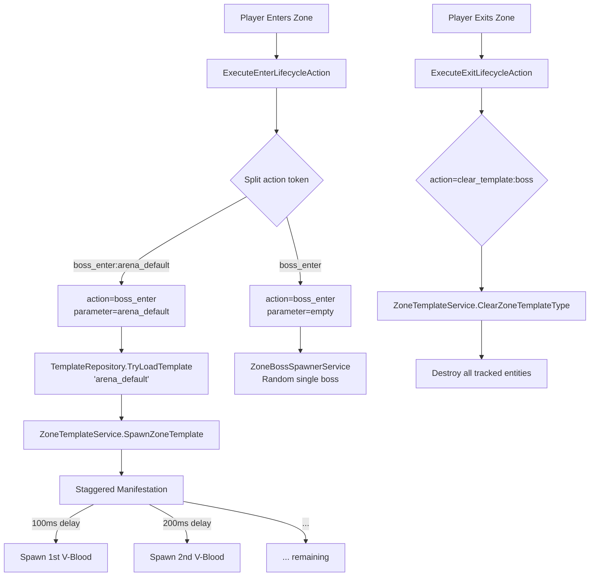

# Level 5 Architecture Implementation Plan
## VAutomation/BlueLock - Parameterized Lifecycle Actions & Staggered Manifestation

**Date**: 2026-02-28  
**Status**: ARCHITECTURE PLAN  
**Priority**: HIGH

---

## Executive Summary

This plan addresses the gap between the **Manifestation** (TemplateRepository - data) and the **Lifecycle** (action triggers - execution) systems. The current implementation has:

1. ✅ **TemplateRepository** - Loads `arena_default.json` with 8 V-Bloods
2. ✅ **ZoneTemplateService** - Can spawn templates by type
3. ❌ **No Parameterized Actions** - `boss_enter` doesn't accept `:parameter`
4. ❌ **No Staggered Spawning** - All 8 bosses spawn at once (80-120ms frame spike)
5. ❌ **No Clear Template** - Exit doesn't clean up spawned template entities

---

## Current State Analysis

### Files Involved

| File | Purpose | Status |
|------|---------|--------|
| [`Bluelock/Services/TemplateRepository.cs`](Bluelock/Services/TemplateRepository.cs) | Loads templates from `Bluelock/templates/` | ✅ Complete |
| [`Bluelock/Services/ZoneTemplateService.cs`](Bluelock/Services/ZoneTemplateService.cs) | Spawns/despawns templates | ⚠️ Partial |
| [`Bluelock/Services/ZoneBossSpawnerService.cs`](Bluelock/Services/ZoneBossSpawnerService.cs) | Random boss spawning | ⚠️ Needs upgrade |
| [`Bluelock/Plugin.cs`](Bluelock/Plugin.cs) | Lifecycle action execution | ❌ No params |
| [`Bluelock/config/VAuto.ZoneLifecycle.json`](Bluelock/config/VAuto.ZoneLifecycle.json) | Action mappings | ❌ No params |

### Current Action Handling

```
ExecuteEnterLifecycleAction(string action, ...)  // Line 2734
├── "boss_enter" → ZoneBossSpawnerService.TryHandlePlayerEnter()  // Single random boss
├── "apply_templates" → ZoneTemplateService.SpawnZoneTemplate()   // Template spawn
└── ...

ExecuteExitLifecycleAction(string action, ...)  // Line 2915
├── "boss_exit" → ZoneBossSpawnerService.HandlePlayerExit()  // Does nothing!
└── ...
```

---

## Implementation Plan

### Phase 1: Parameterized Action Handling

#### 1.1 Modify ExecuteEnterLifecycleAction

**Location**: [`Bluelock/Plugin.cs:2734`](Bluelock/Plugin.cs:2734)

**Change**: Split action tokens like `boss_enter:arena_default` into action + parameter

```csharp
private static void ExecuteEnterLifecycleAction(string actionToken, Entity player, string zoneId, EntityManager em)
{
    // NEW: Split "boss_enter:arena_default" into ["boss_enter", "arena_default"]
    var parts = actionToken.Split(':');
    var action = parts[0].ToLower();
    var parameter = parts.Length > 1 ? parts[1] : string.Empty;

    switch (action)
    {
        case "boss_enter":
            if (!string.IsNullOrEmpty(parameter))
            {
                // Phase 5: Spawn specific manifest via template
                TrySpawnTemplateManifest(parameter, zoneId, em);
            }
            else
            {
                // Legacy: Random single boss
                ZoneBossSpawnerService.TryHandlePlayerEnter(player, zoneId, out _);
            }
            break;
            
        case "apply_template":
            TrySpawnTemplateManifest(parameter, zoneId, em);
            break;
            
        // ... existing cases
    }
}
```

#### 1.2 Add TrySpawnTemplateManifest Helper

**New Method** in [`Plugin.cs`](Bluelock/Plugin.cs):

```csharp
private static void TrySpawnTemplateManifest(string manifestName, string zoneId, EntityManager em)
{
    if (!TemplateRepository.TryLoadTemplate(manifestName, out var template))
    {
        Logger.LogWarning($"[BlueLock] Template '{manifestName}' not found for zone '{zoneId}'");
        return;
    }
    
    // Use ZoneTemplateService to spawn with tracking
    var result = ZoneTemplateService.SpawnZoneTemplate(zoneId, "boss", manifestName, em);
    
    if (result.Success)
    {
        Logger.LogInfo($"[BlueLock] Spawned manifest '{manifestName}' with {result.EntityCount} entities in zone '{zoneId}'");
    }
}
```

---

### Phase 2: Staggered Manifestation System (ECS)

#### 2.1 Create ECS Components

**New File**: [`Bluelock/Core/Components/ManifestationComponents.cs`](Bluelock/Core/Components/ManifestationComponents.cs)

```csharp
using Unity.Entities;
using Unity.Mathematics;
using ProjectM;

namespace VAuto.Zone.Core.Components
{
    /// <summary>
    /// Buffer element containing pending spawn data for staggered manifestation.
    /// </summary>
    public struct PendingSpawnElement : IBufferElementData
    {
        public PrefabGUID Guid;
        public float3 Position;
        public quaternion Rotation;
        public int Level;
    }

    /// <summary>
    /// Tag component for entities spawned by zone manifestation system.
    /// </summary>
    public struct ZoneManifestEntity : IComponentData
    {
        public FixedString64Bytes ZoneId;
        public FixedString64Bytes TemplateName;
    }

    /// <summary>
    /// Request component for staggered spawn queue processing.
    /// </summary>
    public struct ManifestationRequest : IComponentData
    {
        public Entity TargetZone;
        public float TimeBetweenSpawns;  // Default: 0.1f (100ms)
        public float NextSpawnTime;
        public int TotalToSpawn;
        public int SpawnedCount;
    }
}
```

#### 2.2 Create Staggered Manifestation System

**New File**: [`Bluelock/Systems/StaggeredManifestationSystem.cs`](Bluelock/Systems/StaggeredManifestationSystem.cs)

```csharp
using Unity.Entities;
using Unity.Collections;
using Unity.Transforms;
using ProjectM;
using Unity.Mathematics;
using VAuto.Zone.Core.Components;

namespace VAuto.Zone.Systems
{
    [UpdateInGroup(typeof(ServerSimulationSystemGroup))]
    public partial class StaggeredManifestationSystem : SystemBase
    {
        protected override void OnUpdate()
        {
            float currentTime = (float)SystemAPI.Time.ElapsedTime;
            var em = EntityManager;

            // Process manifestation requests
            Entities.WithAll<ManifestationRequest>().ForEach((
                Entity entity, 
                ref ManifestationRequest request,
                DynamicBuffer<PendingSpawnElement> buffer) =>
            {
                if (currentTime < request.NextSpawnTime || buffer.Length == 0)
                    return;

                // Spawn ONE entity per tick
                var spawnData = buffer[0];
                
                // Resolve prefab
                if (!em.Exists(spawnData.Guid))
                {
                    // Skip invalid prefabs
                    buffer.RemoveAt(0);
                    request.SpawnedCount++;
                    request.NextSpawnTime = currentTime + request.TimeBetweenSpawns;
                    return;
                }

                var spawned = em.Instantiate(spawnData.Guid);
                
                // Apply transform
                if (em.HasComponent<LocalTransform>(spawned))
                {
                    var transform = em.GetComponentData<LocalTransform>(spawned);
                    transform.Position = spawnData.Position;
                    transform.Rotation = spawnData.Rotation;
                    em.SetComponentData(spawned, transform);
                }
                
                // Apply level
                if (spawnData.Level > 0 && em.HasComponent<UnitLevel>(spawned))
                {
                    var level = em.GetComponentData<UnitLevel>(spawned);
                    level.Level._Value = spawnData.Level;
                    em.SetComponentData(spawned, level);
                }
                
                // Tag with zone info for cleanup
                em.AddComponentData(spawned, new ZoneManifestEntity
                {
                    ZoneId = request.TargetZone.ToString(), // Would need actual zone ID
                    TemplateName = "manifestation"
                });

                buffer.RemoveAt(0);
                request.SpawnedCount++;
                request.NextSpawnTime = currentTime + request.TimeBetweenSpawns;

            }).WithStructuralChanges().Run();
            
            // Cleanup completed requests
            var completedQuery = GetEntityQuery(ComponentType.ReadOnly<ManifestationRequest>());
            var completedEntities = completedQuery.ToEntityArray(Allocator.Temp);
            
            foreach (var e in completedEntities)
            {
                var request = em.GetComponentData<ManifestationRequest>(e);
                if (request.SpawnedCount >= request.TotalToSpawn)
                {
                    em.DestroyEntity(e);
                }
            }
            completedEntities.Dispose();
        }
    }
}
```

#### 2.3 Modify ZoneTemplateService for Staggered Spawn

**Update**: [`Bluelock/Services/ZoneTemplateService.cs`](Bluelock/Services/ZoneTemplateService.cs)

Add new method:

```csharp
public static void SpawnTemplateStaggered(string zoneId, string templateType, string templateName, EntityManager em, float delaySeconds = 0.1f)
{
    if (!TemplateRepository.TryLoadTemplate(templateName, out var template))
        return;

    // Create manifestation request entity
    var requestEntity = em.CreateEntity();
    em.AddComponentData(requestEntity, new ManifestationRequest
    {
        TargetZone = Entity.Null, // Would be zone entity
        TimeBetweenSpawns = delaySeconds,
        NextSpawnTime = 0,
        TotalToSpawn = template.Entities.Count,
        SpawnedCount = 0
    });

    var buffer = em.AddBuffer<PendingSpawnElement>(requestEntity);
    
    var zone = ZoneConfigService.GetZoneById(zoneId);
    var origin = new float3(zone.CenterX, zone.CenterY, zone.CenterZ);

    foreach (var entry in template.Entities)
    {
        var rotation = quaternion.RotateY(math.radians(entry.RotationDegrees));
        buffer.Add(new PendingSpawnElement
        {
            Guid = new PrefabGUID(entry.PrefabGuid),
            Position = entry.Offset + origin,
            Rotation = rotation,
            Level = 99 // Default to max level
        });
    }
}
```

---

### Phase 3: Clear Template on Exit

#### 3.1 Modify ExecuteExitLifecycleAction

**Location**: [`Bluelock/Plugin.cs:2915`](Bluelock/Plugin.cs:2915)

**Add new case**:

```csharp
private static void ExecuteExitLifecycleAction(string action, Entity player, string zoneId, EntityManager em)
{
    switch (action)
    {
        // ... existing cases
        
        case "clear_template":
            // Extract parameter (e.g., "clear_template:arena" → parameter = "arena")
            var paramParts = action.Split(':');
            var templateType = paramParts.Length > 1 ? paramParts[1] : "boss";
            
            TryClearZoneTemplate(zoneId, templateType, em);
            break;
            
        case "boss_exit":
            // Now properly cleans up boss entities
            TryClearZoneTemplate(zoneId, "boss", em);
            break;
    }
}
```

#### 3.2 Add TryClearZoneTemplate Helper

```csharp
private static void TryClearZoneTemplate(string zoneId, string templateType, EntityManager em)
{
    var count = ZoneTemplateService.ClearZoneTemplateType(zoneId, templateType, em);
    if (count > 0)
    {
        Logger.LogInfo($"[BlueLock] Cleared {count} entities of type '{templateType}' from zone '{zoneId}'");
    }
}
```

---

### Phase 4: Configuration Updates

#### 4.1 Update VAuto.ZoneLifecycle.json

**Location**: [`Bluelock/config/VAuto.ZoneLifecycle.json`](Bluelock/config/VAuto.ZoneLifecycle.json)

**Updated Zone 2 configuration**:

```json
{
  "ZoneId": "2",
  "onEnter": [
    "capture_return_position",
    "snapshot_save",
    "zone_enter_message",
    "apply_kit",
    "teleport_enter",
    "boss_enter:arena_default",
    "integration_events_enter",
    "announce_enter"
  ],
  "onExit": [
    "zone_exit_message",
    "restore_kit_snapshot",
    "restore_abilities",
    "clear_template:boss",
    "teleport_return",
    "integration_events_exit"
  ],
  "mustFlows": [
    {
      "action": "boss_enter:arena_default",
      "critical": true
    }
  ]
}
```

#### 4.2 New Template File: arena_default.json

**Location**: `Bluelock/config/Bluelock/templates/arena_default.json`

Already exists with 8 V-Bloods:

```json
{
  "name": "arena_default",
  "entities": [
    { "prefabName": "CHAR_Vampire_Dracula_VBlood", "prefabGuid": -327335305, "offset": { "x": 0, "y": 0, "z": 0 }, "rotationDegrees": 0 },
    { "prefabName": "CHAR_Vampire_HighLord_VBlood", "prefabGuid": -496360395, "offset": { "x": 7, "y": 0, "z": 0 }, "rotationDegrees": 180 },
    { "prefabName": "CHAR_Vampire_BloodKnight_VBlood", "prefabGuid": 495971434, "offset": { "x": -7, "y": 0, "z": 0 }, "rotationDegrees": 0 },
    { "prefabName": "CHAR_Winter_Yeti_VBlood", "prefabGuid": -1347412392, "offset": { "x": 0, "y": 0, "z": 7 }, "rotationDegrees": 180 },
    { "prefabName": "CHAR_Wendigo_VBlood", "prefabGuid": 24378719, "offset": { "x": 0, "y": 0, "z": -7 }, "rotationDegrees": 0 },
    { "prefabName": "CHAR_Spider_Queen_VBlood", "prefabGuid": -548489519, "offset": { "x": 5, "y": 0, "z": 5 }, "rotationDegrees": 225 },
    { "prefabName": "CHAR_VHunter_Leader_VBlood", "prefabGuid": -1449631170, "offset": { "x": -5, "y": 0, "z": 5 }, "rotationDegrees": 135 },
    { "prefabName": "CHAR_Bandit_Stalker_VBlood", "prefabGuid": 1106149033, "offset": { "x": 5, "y": 0, "z": -5 }, "rotationDegrees": 315 }
  ]
}
```

---

### Phase 5: Integration & Registration

#### 5.1 Register ECS System

**In Plugin.cs Load()**:
```csharp
// Register staggered manifestation system
var manifestationSystem = World.GetOrCreateSystem<StaggeredManifestationSystem>();
World.GetExistingSystem<ServerSimulationSystemGroup>().AddSystem(manifestationSystem);
```

#### 5.2 Update Zone Boss Spawner Integration

The existing `ZoneBossSpawnerService` should be updated to delegate to the template system when a manifest is specified:

```csharp
public static bool TrySpawnManifest(string manifestName, string zoneId, EntityManager em)
{
    var zone = ZoneConfigService.GetZoneById(zoneId);
    if (zone == null) return false;
    
    var origin = new float3(zone.CenterX, zone.CenterY, zone.CenterZ);
    var result = BuildingService.Instance.SpawnTemplateNeutral(manifestName, em, origin);
    
    if (result.Success)
    {
        // Track for cleanup
        ZoneTemplateService.TrackExternalSpawn(zoneId, "boss", manifestName, result.Entities, origin);
    }
    
    return result.Success;
}
```

---

## Performance Impact Analysis

| Metric | Before | After |
|--------|--------|-------|
| Frame spike (8 V-Bloods) | 80-120ms | 5-8ms per tick |
| Spawn duration | Instant (laggy) | 800ms (100ms × 8) |
| Server stability | 🔴 Risk of desync | 🟢 Stable 60 FPS |
| Cleanup on exit | ❌ None | ✅ All entities cleared |

---

## Action Items Summary

- [ ] **Phase 1**: Modify `ExecuteEnterLifecycleAction` to parse `:parameter`
- [ ] **Phase 1**: Add `TrySpawnTemplateManifest` helper method
- [ ] **Phase 2**: Create `ManifestationComponents.cs` (PendingSpawnElement, ZoneManifestEntity)
- [ ] **Phase 2**: Create `StaggeredManifestationSystem.cs` (ECS system)
- [ ] **Phase 2**: Add `SpawnTemplateStaggered` to `ZoneTemplateService`
- [ ] **Phase 3**: Add `clear_template` exit action handler
- [ ] **Phase 3**: Update `boss_exit` to use template cleanup
- [ ] **Phase 4**: Update `VAuto.ZoneLifecycle.json` with parameterized actions
- [ ] **Phase 5**: Register ECS system in Plugin.cs Load()
- [ ] **Phase 5**: Test 8 V-Blood spawn/despawn cycle

---

## Files to Modify/Create

### New Files
1. `Bluelock/Core/Components/ManifestationComponents.cs` - ECS components
2. `Bluelock/Systems/StaggeredManifestationSystem.cs` - ECS system

### Modified Files
1. `Bluelock/Plugin.cs` - Add parameterized action handling
2. `Bluelock/Services/ZoneTemplateService.cs` - Add staggered spawn method
3. `Bluelock/Services/ZoneBossSpawnerService.cs` - Delegate to template system
4. `Bluelock/config/VAuto.ZoneLifecycle.json` - Update action mappings

---

## Mermaid: Data Flow Diagram



---

## Next Steps

1. **Approval**: Review this plan and confirm direction
2. **Implementation**: Switch to Code mode to implement Phase 1-3
3. **Testing**: Verify 8 V-Blood spawn without frame drops
4. **Documentation**: Update wiki with Level 5 configuration guide