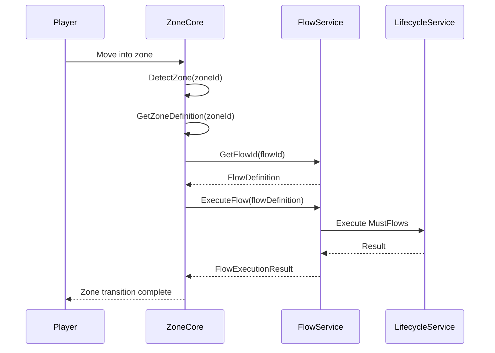

# Zone Flow Configuration Architecture Plan

## Overview

This document outlines the architecture for extending the VAutoZone system with flow-based configuration support, adding Flow IDs (A1, B1, T3, ZoneDefault), radius validation, and "Must Flows" support while maintaining compatibility with the existing 5 zones.

## 1. Current Architecture Analysis

### Existing Components

| Component | File | Purpose |
|-----------|------|---------|
| Zone Definitions | `Bluelock/config/VAuto.Zones.json` | Zone geometry, positions, kits |
| Lifecycle Config | `Bluelock/config/VAuto.ZoneLifecycle.json` | Zone-to-lifecycle mappings |
| ZoneDefinition Model | `Bluelock/Models/ZoneDefinition.cs` | Zone data model |
| ZoneLifecycleConfig | `Configuration/ZoneLifecycleConfig.cs` | Lifecycle stage configuration |
| FlowService | `Core/Api/FlowService.cs` | Flow execution engine |

### Current Limitations

1. No Flow ID concept in zone definitions
2. Single wildcard mapping in lifecycle config
3. No radius validation (entry vs exit)
4. Flow steps not organized by zone/flow

---

## 2. Proposed Architecture

### 2.1 Zone Definition Enhancement

Add Flow ID support to [`Bluelock/Models/ZoneDefinition.cs`](Bluelock/Models/ZoneDefinition.cs):

```csharp
public class ZoneDefinition
{
    // ... existing fields ...
    
    /// <summary>
    /// Flow ID for this zone (A1, B1, T3, ZoneDefault)
    /// </summary>
    public string FlowId { get; set; } = "ZoneDefault";
    
    /// <summary>
    /// Fallback flow when this zone's flow is not found
    /// </summary>
    public string FlowFallback { get; set; } = "ZoneDefault";
    
    /// <summary>
    /// Entry radius for zone detection
    /// </summary>
    public float EntryRadius { get; set; }
    
    /// <summary>
    /// Exit radius for zone detection (must exceed EntryRadius)
    /// </summary>
    public float ExitRadius { get; set; }
}
```

### 2.2 Lifecycle Mapping Enhancement

Add flow ID and must flows to [`Configuration/UnifiedZoneLifecycleConfig.cs`](Configuration/UnifiedZoneLifecycleConfig.cs):

```csharp
public class UnifiedLifecycleMapping
{
    // ... existing fields ...
    
    /// <summary>
    /// Flow ID associated with this zone mapping
    /// </summary>
    public string FlowId { get; set; } = "ZoneDefault";
    
    /// <summary>
    /// Must-Execute flows (required steps that cannot fail)
    /// </summary>
    public List<MustFlowStep> MustFlows { get; set; } = new();
}

public class MustFlowStep
{
    /// <summary>
    /// Action name to execute
    /// </summary>
    public string Action { get; set; }
    
    /// <summary>
    /// Arguments for the action
    /// </summary>
    public object[] Args { get; set; }
    
    /// <summary>
    /// Stop execution if this step fails
    /// </summary>
    public bool Critical { get; set; } = true;
}
```

---

## 3. Zone Configuration Specification

### 3.1 Zone-to-Flow Mapping

| Zone ID | Flow ID | Default Fallback | Purpose |
|---------|---------|------------------|---------|
| 1 | A1 | ZoneDefault | Arena Zone 1 |
| 2 | B1 | ZoneDefault | Boss Zone |
| 3 | T3 | ZoneDefault | Template Building |
| 4 | ZoneDefault | ZoneDefault | Default Zone |

### 3.2 Radius Configuration

Each zone must define both entry and exit radii:

```json
{
  "id": "1",
  "flowId": "A1",
  "flowFallback": "ZoneDefault",
  "entryRadius": 30.0,
  "exitRadius": 45.0
}
```

**Validation Rule**: `ExitRadius > EntryRadius`

---

## 4. File Organization

### 4.1 Flow Step Files

Organize flow steps by flow ID in the Bluelock project (one file per flow containing both Enter and Exit):

```
Bluelock/config/flows/
  A1.json           # Flow A1 (Enter + Exit steps)
  B1.json           # Flow B1 (Enter + Exit steps)
  T3.json           # Flow T3 (Enter + Exit steps)
  ZoneDefault.json  # Default flow for all zones
```

### 4.2 Flow File Schema

```json
{
  "flowId": "A1",
  "description": "Arena Zone 1 flow configuration",
  "onEnter": [
    { "action": "capture_return_position", "critical": false },
    { "action": "apply_kit", "args": ["Kit1"], "critical": false },
    { "action": "message_user", "args": ["Welcome to Zone A1!"], "critical": false }
  ],
  "onExit": [
    { "action": "restore_kit_snapshot", "critical": false },
    { "action": "teleport_return", "critical": true }
  ],
  "mustFlows": [
    { "action": "validate_zone_bounds", "critical": true }
  ]
}
```

---

## 5. System Integration

### 5.1 Flow Resolution Logic

```
ZoneTransition(player) ->
  GetZoneDefinition(zoneId) ->
    GetFlowId() ->
      LoadFlowDefinition(flowId) ->
        ExecuteFlow(flowDefinition)
```

### 5.2 Radius Detection

```csharp
public bool IsInsideZone(float x, float z, ZoneDefinition zone)
{
    // Use entry radius for entering
    var detectionRadius = IsEntering 
        ? zone.EntryRadius 
        : zone.ExitRadius;
        
    return Distance(x, z, zone.Center) <= detectionRadius;
}
```

### 5.3 Must Flows Execution

```csharp
public FlowExecutionResult ExecuteMustFlows(List<MustFlowStep> mustFlows)
{
    foreach (var step in mustFlows)
    {
        var result = ExecuteAction(step.Action, step.Args);
        
        if (!result.Success && step.Critical)
        {
            // Critical must-flow failed - stop execution
            return FlowExecutionResult.Fail(...);
        }
    }
    return FlowExecutionResult.Ok(...);
}
```

---

## 6. Implementation Steps

### Step 1: Model Updates
- [ ] Add FlowId, FlowFallback to [`Bluelock/Models/ZoneDefinition.cs`](Bluelock/Models/ZoneDefinition.cs)
- [ ] Add EntryRadius, ExitRadius fields
- [ ] Add MustFlowStep and MustFlows to [`Configuration/UnifiedZoneLifecycleConfig.cs`](Configuration/UnifiedZoneLifecycleConfig.cs)

### Step 2: Configuration Files
- [ ] Create [`Bluelock/config/flows/`](Bluelock/config/flows/) directory
- [ ] Add flow JSON files (A1.json, B1.json, T3.json, ZoneDefault.json)
- [ ] Update [`Bluelock/config/VAuto.Zones.json`](Bluelock/config/VAuto.Zones.json) with new fields
- [ ] Update [`Bluelock/config/VAuto.ZoneLifecycle.json`](Bluelock/config/VAuto.ZoneLifecycle.json) with flow mappings

### Step 3: Service Updates
- [ ] Update [`Core/Api/FlowService.cs`](Core/Api/FlowService.cs) to support must flows
- [ ] Add zone-to-flow resolution in lifecycle system
- [ ] Implement radius validation logic
- [ ] Add flow file loading service

### Step 4: Testing
- [ ] Test zone transitions with flow IDs
- [ ] Verify radius detection works correctly
- [ ] Validate must flows execute properly

---

## 7. Backward Compatibility

- Default FlowId = "ZoneDefault" when not specified
- EntryRadius defaults to current Radius if not set
- ExitRadius defaults to EntryRadius if not set
- All existing zones 1-5 continue to work unchanged

---

## 8. Mermaid Diagram: Flow Resolution



---

## 9. Summary

This architecture provides:
1. **Flow IDs**: A1, B1, T3, ZoneDefault for zone categorization
2. **Radius Validation**: Entry/Exit radius detection for smooth transitions
3. **Must Flows**: Required steps that execute regardless of other failures
4. **Modular Organization**: Flow steps in separate files per zone/flow
5. **Backward Compatibility**: Existing zones continue to work unchanged